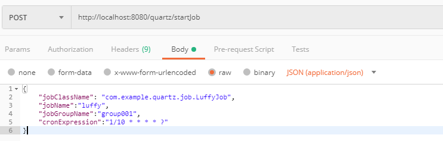
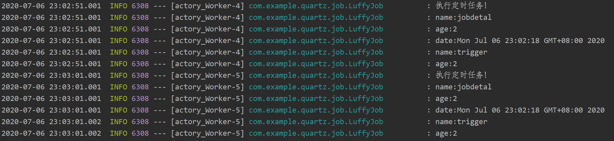

# 一、Spring Boot整合Quartz介绍

&emsp;&emsp;Spring Boot整合Quartz，任务执行，异常和中断处理，具体实现思路和细节请参考:

> [Spring Boot整合Quartz](https://www.jianshu.com/p/52133fcb8671)

- 简易任务执行
- DataMap应用
- 异常和中断处理

# 二、前期准备

## 2.1 MySQL数据库准备:

- 对应的SQL见 /src/main/resources/SQL/quartz.sql
- 创建数据库quartz
- 建表
- MySQL配置信息见 /src/main/resources/application.yaml

## 2.2 PostMan测试工具准备:

- [下载地址](https://www.postman.com/)

# 三、测试信息

&emsp;&emsp;Quartz请求测试信息：

&emsp;&emsp;Quartz输出结果信息：

